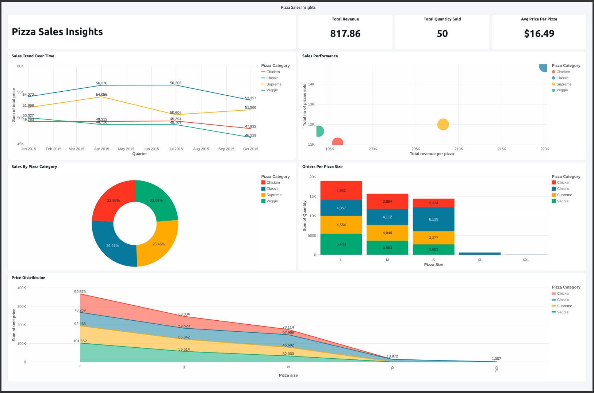
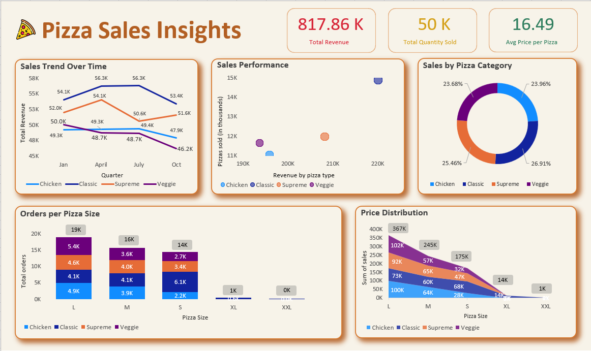
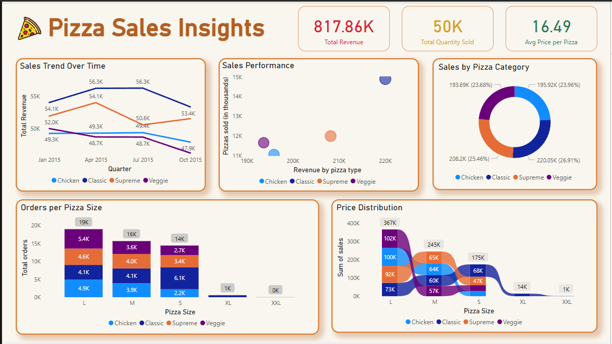

# 🍕 Pizza Sales Insights

Welcome to the Pizza Sales Insights project! This repository showcases a complete analytics workflow for pizza sales data, featuring data processing, analysis, and interactive dashboards built with Databricks, Excel, and Power BI.

---

## 📁 Project Structure

- [`data/`](./data/)  
  Raw pizza sales dataset (`Pizza_Sales.csv`).

- [`notebooks/`](./notebooks/)  
  Jupyter and Databricks notebooks for data exploration and analysis.  
  - `Pizza Insights.ipynb`: Main analysis notebook.  
  - `Pizza-Insights.py`: Databricks notebook script.

- [`dashboards/`](./dashboards/)  
  Interactive and static dashboards built with different BI tools:
  - [`databricks/`](./dashboards/databricks/): Databricks AI-BI dashboard.
  - [`excel/`](./dashboards/excel/): Excel dashboard.
  - [`powerbi/`](./dashboards/powerbi/): Power BI dashboard.

- [`docs/`](./docs/)  
  Additional documentation and reports.

---

## 🚀 Project Overview

This project demonstrates:
- **Data Loading:** Raw sales data in [`data/Pizza_Sales.csv`](./data/Pizza_Sales.csv).
- **Analysis & Transformation:**  
  Code and analysis in [`notebooks/`](./notebooks/) using PySpark, SQL, and Python visualizations.
- **Dashboards:**  
  Visualizations and KPIs presented using Databricks, Excel, and Power BI dashboards.
- **Documentation:**  
  Supporting documents in [`docs/`](./docs/).

---

## 📊 Dashboard Previews

### Databricks AI-BI Dashboard

**Description:**  
This dashboard, built in Databricks, provides real-time analytics with interactive charts for sales trends, category distribution, and performance metrics. It leverages Spark SQL and PySpark for scalable data processing[1].

---

### Excel Dashboard

**Description:**  
The Excel dashboard offers accessible, static visual summaries of pizza sales, including trend lines, category breakdowns, and order size analysis. Ideal for quick sharing and offline insights[2].

---

### Power BI Dashboard

**Description:**  
Power BI delivers an interactive business intelligence experience, enabling deep dives into sales metrics, dynamic filtering, and visually engaging charts for executive reporting[3].

---

## 🗂️ How to Use

1. **Clone the repository:** [ai-bi-dashboard](https://github.com/sanskardevx/ai-bi-dashboard.git)
  
