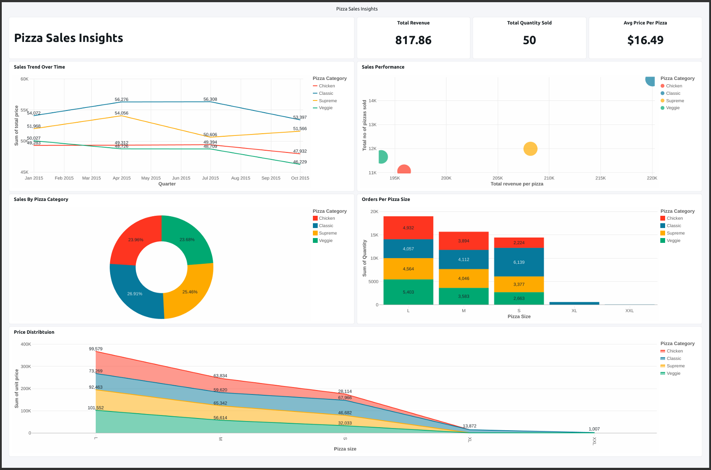
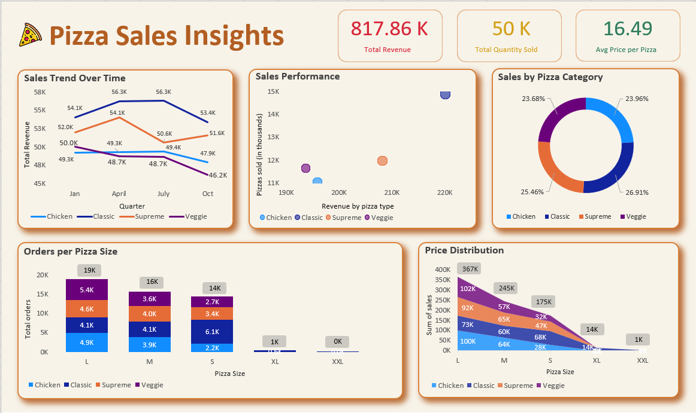
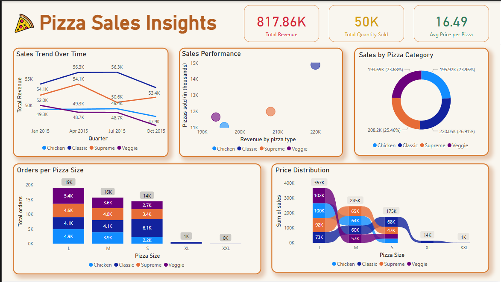

# 🍕 Pizza Sales Insights

This project demonstrates an end-to-end **data analytics workflow** for pizza sales data covering data cleaning, transformation, and visualization using **SQL, Python, Excel, Power BI, and Databricks**.  

---

## 🎯 Objective
To analyze pizza sales performance and uncover insights that improve business decisions on **revenue, product mix, and customer behavior**.

---

## 📁 Project Structure

- [`data/`](./data/) – Raw pizza sales dataset (`Pizza_Sales.csv`)
- [`notebooks/`](./notebooks/) – Databricks notebooks for data exploration and analysis  
- [`dashboards/`](./dashboards/) – Interactive dashboards built with:
  - [`databricks/`](./dashboards/databricks/) – Databricks AI-BI dashboard  
  - [`excel/`](./dashboards/excel/) – Excel dashboard  
  - [`powerbi/`](./dashboards/powerbi/) – Power BI dashboard

---

## 🚀 Project Overview

This project demonstrates:
- **Data Loading & Cleaning:** Raw data imported from CSV and processed using Python (Pandas) and SQL in Databricks.  
- **Exploratory Data Analysis (EDA):** Identified patterns in sales by category, size, and time using Python visualizations.  
- **Dashboard Development:** Designed interactive dashboards in Power BI, Excel, and Databricks to visualize KPIs.  
- **Insight Communication:** Delivered clear visuals and business insights to support decision-making.

---

## 💡 Key Insights
- 💵 The business generated a total revenue of **$817.86K** from approximately **50K pizzas sold**, with an **average selling price of $16.49 per pizza**.  
- 📈 **Classic pizzas** were the **best-performing category**, contributing the highest share of total revenue (≈27%), followed closely by **Supreme** and **Chicken** pizzas.  
- 🍕 **Large-sized pizzas** dominated sales volume (**19K orders**), indicating a customer preference for larger sizes and higher-value purchases.  
- 🗓️ **Quarterly sales trends** remained stable, with a noticeable dip in October — suggesting potential for seasonal or promotional strategies to boost Q4 performance.  
- 💰 Revenue distribution shows **L and M sizes** as the most profitable tiers, while **XL and XXL pizzas** have minimal contribution, highlighting opportunities for menu optimization or bundled offers.

---

## 📊 Dashboard Previews

### 🔹 Databricks AI-BI Dashboard


**Description:**  
Built in Databricks using PySpark and Spark SQL, this dashboard provides interactive sales trend analysis and real-time performance metrics.

---

### 🔹 Excel Dashboard


**Description:**  
Excel dashboard offering static yet clear visuals for sales trends, product category breakdowns, and order analysis — ideal for quick business reporting.

---

### 🔹 Power BI Dashboard


**Description:**  
Interactive Power BI dashboard featuring slicers, KPIs, and charts for detailed revenue and performance exploration.

---

## 🧠 Key Learnings
- Strengthened **SQL and Python** skills for cleaning and EDA.  
- Built end-to-end BI dashboards with **Power BI and Excel**.  
- Practiced **storytelling through data** — converting raw data into insights.  
- Improved ability to communicate findings visually for **business decision-making**.

---

## 🗂️ How to Use

1. **Clone the repository:**  
   ```bash
   git clone https://github.com/sanskardevx/pizza-sales-insights.git
